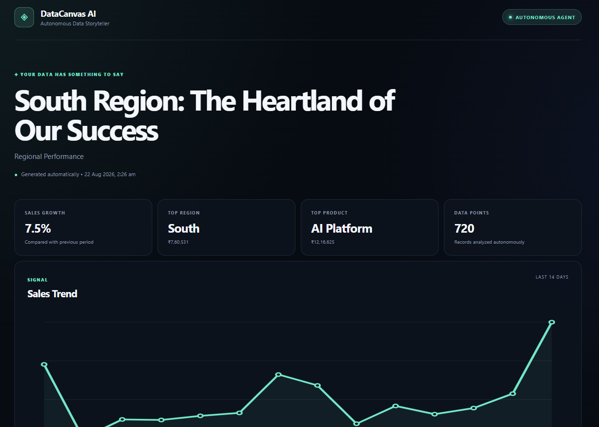
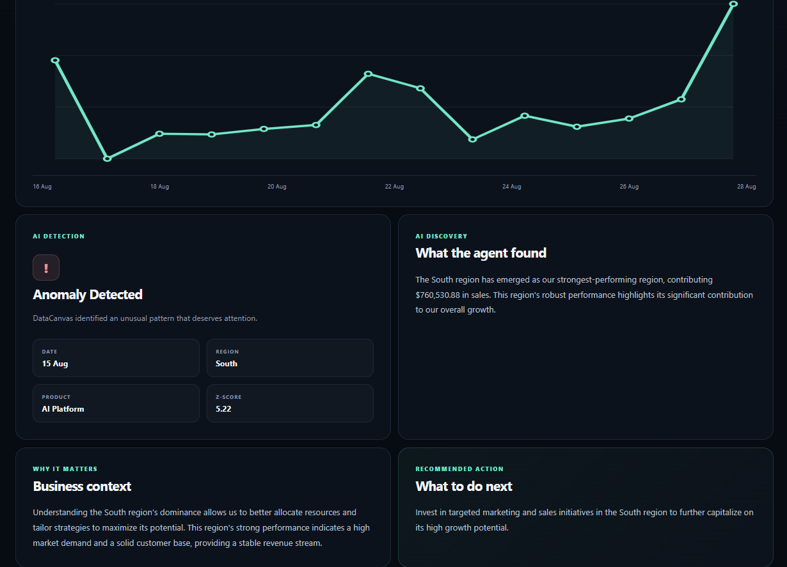

# DataCanvas AI

### Autonomous Data Storytelling Agent

DataCanvas AI is an AWS-native Generative AI application that transforms structured business data into an automatically generated data story.

The system retrieves business data from Amazon S3, performs data-science analysis, identifies trends and statistical anomalies, sends the analytical findings to Amazon Bedrock using Amazon Nova Lite, generates a business-oriented narrative, stores the result, and exposes the latest analysis through an API-powered dashboard.

The goal is simple:

> **Turn raw business data into insights, context, and recommended actions.**

---

## 🚀 Live Demo

### Dashboard

https://production.d3vw8ggpikqmd.amplifyapp.com/

### API

https://pvartqowob.execute-api.ap-south-1.amazonaws.com/latest

The dashboard retrieves the latest generated analysis through the API.

---

# 🎯 Project Overview

Traditional dashboards are excellent at displaying KPIs, charts, and metrics, but users still need to interpret those numbers themselves.

DataCanvas AI adds a Generative AI layer on top of a data-analysis pipeline.

Instead of only showing:

```text
Sales: ₹2.61M
Growth: 7.5%
Top Region: South
Top Product: AI Platform
```

DataCanvas AI attempts to produce a more useful business narrative:

```text
What happened?
        ↓
Why does it matter?
        ↓
What unusual patterns were detected?
        ↓
What should be investigated or acted upon?
```

The project combines:

- Data Science
- Generative AI
- Amazon Bedrock
- Amazon Nova Lite
- AWS Lambda
- Amazon S3
- API Gateway
- EventBridge Scheduler
- AWS Amplify
- IAM
- CloudWatch

---

# 🧠 Core Concept

The DataCanvas AI pipeline follows this flow:

```text
                 Business Dataset
                       │
                       ▼
                ┌─────────────┐
                │  Amazon S3  │
                └──────┬──────┘
                       │
                       ▼
              ┌─────────────────┐
              │   AWS Lambda    │
              │  AI Agent       │
              └────────┬────────┘
                       │
             ┌─────────┼─────────┐
             │         │         │
             ▼         ▼         ▼
          Growth     Trends    Anomaly
          Analysis   Analysis  Detection
             │         │         │
             └─────────┼─────────┘
                       │
                       ▼
              ┌─────────────────┐
              │ Amazon Bedrock  │
              │ Amazon Nova     │
              │ Lite            │
              └────────┬────────┘
                       │
                       ▼
              ┌─────────────────┐
              │ Generated Data  │
              │ Story            │
              └────────┬────────┘
                       │
                       ▼
                ┌─────────────┐
                │  Amazon S3  │
                │   Outputs   │
                └──────┬──────┘
                       │
                       ▼
              ┌─────────────────┐
              │   AWS Lambda    │
              │ Read Output     │
              └────────┬────────┘
                       │
                       ▼
              ┌─────────────────┐
              │  API Gateway    │
              │  GET /latest    │
              └────────┬────────┘
                       │
                       ▼
              ┌─────────────────┐
              │  AWS Amplify    │
              │   Dashboard     │
              └─────────────────┘
```

---

# 🏗️ AWS Architecture

DataCanvas AI uses a serverless AWS architecture.

| Component | AWS Service | Purpose |
|---|---|---|
| Dataset storage | Amazon S3 | Stores the input business dataset |
| AI processing | AWS Lambda | Runs the analysis and AI storytelling pipeline |
| Generative AI | Amazon Bedrock | Provides foundation-model inference |
| AI model | Amazon Nova Lite | Generates the business narrative |
| Output storage | Amazon S3 | Stores generated analysis |
| Output API | AWS Lambda | Retrieves the latest generated result |
| API layer | Amazon API Gateway | Exposes the `/latest` endpoint |
| Automation | Amazon EventBridge Scheduler | Periodically invokes the AI agent |
| Frontend | AWS Amplify | Hosts the dashboard |
| Monitoring | Amazon CloudWatch | Stores execution logs |
| Security | AWS IAM | Controls service permissions |

---

# 🔄 End-to-End Workflow

## 1. Dataset Ingestion

The application reads a structured CSV dataset from Amazon S3.

Example:

```csv
date,region,product,sales,customers,orders
2026-07-01,South,AI Platform,5379.8,124,66
2026-07-01,South,Cloud Tools,3008.98,110,51
2026-07-01,South,Data Services,2723.25,92,47
```

The current sample dataset contains **720 records**.

---

## 2. Data Science Analysis

The main Lambda function analyzes the dataset and calculates:

- Total sales
- Total customers
- Total orders
- Sales growth
- Customer growth
- Order growth
- Top-performing region
- Top-performing product
- Fastest-growing product
- Daily sales trends
- Statistical anomalies
- Recent chart data

Example analytical output:

```json
{
  "dataset_records": 720,
  "total_sales": 2616505.87,
  "total_customers": 72889,
  "total_orders": 38631,
  "growth": {
    "sales_percent": 7.5,
    "customers_percent": 7.52,
    "orders_percent": 7.77
  },
  "top_region": {
    "name": "South",
    "sales": 760530.88
  },
  "top_product": {
    "name": "AI Platform",
    "sales": 1216625.19
  },
  "fastest_growing_product": {
    "name": "AI Platform",
    "growth_percent": 8.3
  }
}
```

---

# 🚨 Anomaly Detection

DataCanvas AI also looks for statistically unusual observations.

One example generated by the current dataset:

```text
Date:       15 August 2026
Region:     South
Product:    AI Platform
Sales:      ₹10,623.08
Z-score:    5.22
```

The anomaly is surfaced as a signal for further investigation rather than automatically treating it as a business conclusion.

---

# 🤖 Generative AI Layer

After the deterministic data analysis is completed, the analytical findings are passed to Amazon Bedrock.

The current implementation uses:

```text
Amazon Nova Lite
Model:
apac.amazon.nova-lite-v1:0
```

Amazon Nova Lite is used to transform the analytical findings into a structured business story.

The generated response contains:

- Title
- Theme
- Insight
- Why it matters
- Recommended action
- Anomaly explanation

Example:

```text
Title:
AI Platform's Dominant Surge: The Growth Catalyst

Theme:
Product Growth Performance

Insight:
The AI Platform has emerged as the fastest-growing product,
significantly driving sales and orders.

Why it matters:
The AI Platform's growth is pivotal as it contributes
significantly to the company's revenue and market presence.

Recommended action:
Allocate more resources to enhance the marketing and
development of the AI Platform.
```

---

# ⏱️ Autonomous Scheduling

The AI agent can be invoked automatically using Amazon EventBridge Scheduler.

Current scheduler:

```text
datacanvas-ai-autonomous-schedule
```

The scheduler is configured as a fixed-rate schedule.

The resulting workflow is:

```text
EventBridge Scheduler
        │
        ▼
AWS Lambda
        │
        ▼
S3 Dataset
        │
        ▼
Data Science Analysis
        │
        ▼
Amazon Bedrock
        │
        ▼
Generated Story
        │
        ▼
S3 Output
```

This removes the requirement for manually invoking the main Lambda function for each generation cycle.

---

# 📊 Dashboard

The frontend presents the latest generated DataCanvas AI story in a business-oriented dashboard.

The dashboard currently includes:

- AI-generated headline
- Sales growth
- Top region
- Top product
- Dataset size
- Sales trend
- Anomaly detection
- AI discovery
- Business context
- Recommended action
- Generation timestamp

---

## Dashboard Screenshot — Overview



---

## Dashboard Screenshot — AI-Generated Story



---

# 🔌 API

The dashboard communicates with the backend through Amazon API Gateway.

## Endpoint

```text
GET /latest
```

Live endpoint:

```text
https://pvartqowob.execute-api.ap-south-1.amazonaws.com/latest
```

The endpoint returns the latest generated DataCanvas AI output.

Example:

```json
{
  "project": "DataCanvas AI",
  "generated_at": "2026-08-21T19:56:57.143296+00:00",
  "title": "AI Platform's Dominant Surge: The Growth Catalyst",
  "theme": "Product Growth Performance",
  "insight": "The AI Platform has emerged as the fastest-growing product...",
  "why_it_matters": "The AI Platform's growth is pivotal...",
  "action": "Allocate more resources to enhance the marketing and development...",
  "findings": {
    "dataset_records": 720,
    "total_sales": 2616505.87,
    "total_customers": 72889,
    "total_orders": 38631,
    "top_region": {
      "name": "South",
      "sales": 760530.88
    },
    "top_product": {
      "name": "AI Platform",
      "sales": 1216625.19
    }
  }
}
```

---

# 📁 Repository Structure

```text
datacanvas-ai/
│
├── frontend/
│   ├── app.js
│   ├── index.html
│   └── style.css
│
├── lambda/
│   │
│   ├── datacanvas-ai-agent/
│   │   └── lambda_function.py
│   │
│   └── datacanvas-read-output/
│       └── lambda_function.py
│
├── sample-data/
│   └── datacanvas_sample_data.csv
│
├── images/
│   ├── dashboard-1.png
│   └── dashboard-2.png
│
├── README.md
├── .gitignore
└── LICENSE
```

---

# 🧩 Project Components

## `frontend/`

Contains the DataCanvas AI web dashboard.

### `index.html`

Defines the dashboard structure and UI components.

### `style.css`

Contains the dashboard styling and responsive layout.

### `app.js`

Handles communication with the API and dynamically renders the latest DataCanvas AI output.

---

## `lambda/datacanvas-ai-agent/`

Contains the primary autonomous AI agent.

The function:

1. Loads the dataset from Amazon S3
2. Performs data analysis
3. Calculates growth metrics
4. Detects anomalies
5. Identifies important signals
6. Calls Amazon Bedrock
7. Generates the data story
8. Stores the generated output
9. Stores historical output
10. Returns the generation result

---

## `lambda/datacanvas-read-output/`

Contains the Lambda function responsible for retrieving the latest generated output.

It provides the backend functionality used by:

```text
API Gateway
     ↓
GET /latest
     ↓
datacanvas-read-output
     ↓
Amazon S3
```

---

## `sample-data/`

Contains the sample business dataset used by the project.

The dataset contains:

- Date
- Region
- Product
- Sales
- Customers
- Orders

---

## `images/`

Contains screenshots of the deployed DataCanvas AI dashboard.

---

# 🔐 Security & IAM

The application uses AWS IAM roles to control access between AWS services.

The main AI agent requires permissions for the services involved in:

- Reading the dataset from S3
- Writing generated output to S3
- Invoking Amazon Bedrock
- Writing logs to CloudWatch

The read-output Lambda requires permissions to retrieve generated output from S3 and write execution logs.

The architecture uses service-specific IAM roles instead of embedding AWS credentials inside the application code.

---

# 📈 Example Findings

Using the current sample dataset, the analysis identified:

### Overall Performance

```text
Sales Growth       7.5%
Customer Growth    7.52%
Order Growth       7.77%
```

### Regional Performance

```text
Top Region:
South

Sales:
₹760,530.88
```

### Product Performance

```text
Top Product:
AI Platform

Sales:
₹1,216,625.19
```

### Fastest Growing Product

```text
AI Platform

Growth:
8.3%
```

### Strongest Detected Anomaly

```text
Date:
15 August 2026

Region:
South

Product:
AI Platform

Z-score:
5.22
```

---

# 🛠️ Technology Stack

## AWS

- Amazon S3
- AWS Lambda
- Amazon Bedrock
- Amazon API Gateway
- Amazon EventBridge Scheduler
- AWS Amplify
- AWS IAM
- Amazon CloudWatch

## AI / Data

- Generative AI
- Amazon Nova Lite
- Statistical analysis
- Trend analysis
- Growth analysis
- Anomaly detection
- Automated data storytelling

## Development

- Python
- JavaScript
- HTML
- CSS
- Git
- GitHub

---

# 💡 Why DataCanvas AI?

The project explores a shift from traditional dashboarding toward AI-assisted data interpretation.

### Traditional Dashboard

```text
Data
 ↓
Charts
 ↓
KPIs
 ↓
Human Interpretation
```

### DataCanvas AI

```text
Data
 ↓
Data Science Analysis
 ↓
Signal Detection
 ↓
Generative AI
 ↓
Business Narrative
 ↓
Recommended Action
```

The objective is not simply to display more information.

It is to make the information easier to interpret.

---

# ⚠️ Current Limitations

DataCanvas AI is currently a working prototype/MVP.

Current limitations include:

- The sample dataset is synthetic/demo business data.
- The dashboard currently focuses primarily on sales-oriented analysis.
- The current dataset source is configured through Amazon S3.
- The current frontend primarily presents the latest generated analysis.
- AI-generated recommendations should be treated as decision-support rather than authoritative business decisions.
- User-driven dataset uploads are not yet implemented.
- Natural-language querying over arbitrary datasets is not yet implemented.
- The current system does not yet provide a fully general-purpose BI experience.

---

# 🔮 Future Roadmap

## 1. Interactive Dataset Upload

Allow users to upload CSV or Excel files directly through the dashboard.

```text
User
 ↓
Upload Dataset
 ↓
Amazon S3
 ↓
DataCanvas AI
 ↓
Automatic Analysis
```

---

## 2. Automatic Schema Detection

Automatically identify:

- Numeric columns
- Categorical columns
- Date columns
- Metrics
- Dimensions

and determine which analytical methods are appropriate for a dataset.

---

## 3. Natural-Language Data Questions

Allow users to ask questions such as:

```text
Why did sales increase this month?

Which region is performing best?

Which product has the highest growth?

What caused the largest anomaly?

Where should we focus our next campaign?
```

The system would analyze the underlying data before generating the response.

---

## 4. Multi-Agent Architecture

A future version could separate responsibilities across specialized agents:

```text
                    DataCanvas AI
                         │
          ┌──────────────┼──────────────┐
          │              │              │
          ▼              ▼              ▼
     Data Analyst    Anomaly Agent   Story Agent
        Agent            Agent          Agent
          │              │              │
          └──────────────┼──────────────┘
                         │
                         ▼
                  Decision Support
```

Potential agents could include:

- Data Analyst Agent
- Anomaly Detection Agent
- Forecasting Agent
- Business Storytelling Agent
- Recommendation Agent

---

## 5. Automated Reports

Future versions could generate:

- Executive summaries
- PDF reports
- Weekly business reports
- Email summaries
- Scheduled management briefings

---

## 6. More Data Sources

Potential future integrations include:

- CSV
- Excel
- JSON
- Amazon RDS
- Amazon Redshift
- Amazon Athena
- Data warehouses
- Streaming data

---

# 🧪 Local Development

Clone the repository:

```bash
git clone https://github.com/Muddu397/datacanvas-ai.git
```

Move into the project:

```bash
cd datacanvas-ai
```

Open in VS Code:

```bash
code .
```

Project directories:

```text
frontend/
lambda/
sample-data/
```

The production deployment uses AWS services configured in the AWS account.

---

# ☁️ High-Level Deployment

The project was implemented using the following deployment flow:

```text
1. Create S3 bucket
        ↓
2. Upload dataset
        ↓
3. Create IAM role
        ↓
4. Deploy AI Agent Lambda
        ↓
5. Configure Amazon Bedrock
        ↓
6. Configure S3 output storage
        ↓
7. Deploy Read Output Lambda
        ↓
8. Create API Gateway
        ↓
9. Configure EventBridge Scheduler
        ↓
10. Deploy frontend with AWS Amplify
```

---

# 📋 Implementation Status

## Core Pipeline

- [x] Amazon S3 dataset storage
- [x] AWS Lambda data processing
- [x] Data analysis
- [x] Growth calculations
- [x] Trend analysis
- [x] Statistical anomaly detection
- [x] Amazon Bedrock integration
- [x] Amazon Nova Lite integration
- [x] AI-generated data storytelling
- [x] S3 output storage
- [x] Historical output generation
- [x] Read-output Lambda
- [x] Amazon API Gateway
- [x] EventBridge Scheduler
- [x] AWS Amplify dashboard
- [x] GitHub repository
- [x] Dashboard screenshots

## Future Features

- [ ] Interactive dataset upload
- [ ] Automatic schema detection
- [ ] Natural-language data querying
- [ ] Multi-agent architecture
- [ ] Forecasting
- [ ] Automated PDF reports
- [ ] Email-based reporting
- [ ] Multiple data-source integrations

---

# 📸 Screenshots

## DataCanvas AI Dashboard


## AI-Generated Data Story


---

# 👨‍💻 Author

## Mohammed Mudasser

AI/ML & Data Science  
Generative AI | AWS | Machine Learning | Data Engineering

GitHub:

https://github.com/Muddu397

---

# ⭐ Project

If you find the project interesting, feel free to explore the repository, review the architecture, and experiment with the implementation.

GitHub Repository:

https://github.com/Muddu397/datacanvas-ai

---

# 📄 License

This project is licensed under the MIT License.

See the [LICENSE](LICENSE) file for details.